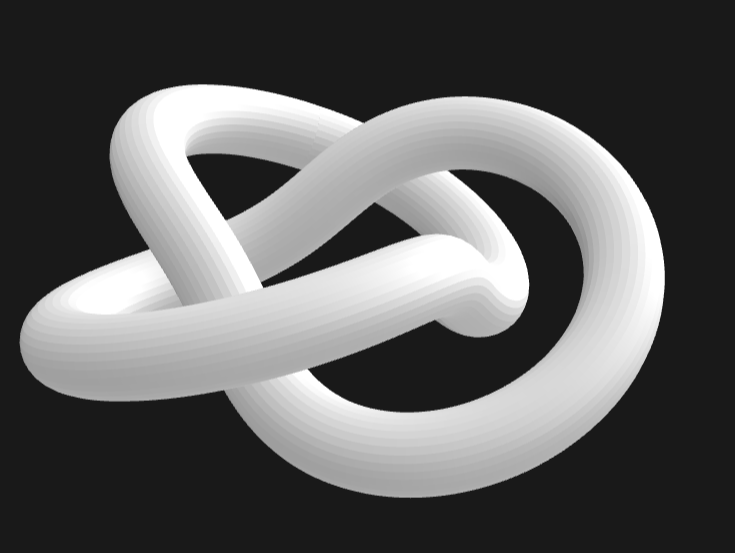

# SolidSKeleton Examples

This directory contains folders with example `.ssk` files that demonstrate valid SolidSKeleton documents.

All files in this example directory have been parsed through the reference scripts in `/implementation/packages` and rendered in the [glTF Viewer](https://gltf-viewer.donmccurdy.com/) by Don McCurdy.

---

## `csg_cube.ssk` / `csg_cube.sskb`
A CSG example cube using `add`, `subtract`, and `intersect`

The `.ssk` file is *943 bytes* and the `.sskb` file is *314 bytes*.

The CSG cube uses many core CSG principles.

---

## `ladder.ssk` / `ladder.sskb`
A ladder with 14 steps

The `.ssk` file is *2347 bytes* and the `.sskb` file is *870 bytes*.

The ladder describes the use of the `from` class strongly.

---

## Primitives

A collection of eight standard geometric primitives, each demonstrating basic shape construction techniques.

### `cube.ssk` / `cube.sskb`
A regular cube using a 4-sided `ngon` with 45° rotation

The `.ssk` file is *283 bytes* and the `.sskb` file is *98 bytes*.

### `sphere.ssk` / `sphere.sskb`
An ellipsoid using a point-defined `circle` shape

The `.ssk` file is *162 bytes* and the `.sskb` file is *64 bytes*.

### `cuboid.ssk` / `cuboid.sskb`
A rectangular box with extended height

The `.ssk` file is *283 bytes* and the `.sskb` file is *98 bytes*.

### `triangular_prism.ssk` / `triangular_prism.sskb`
A triangular cross-section swept along a path

The `.ssk` file is *217 bytes* and the `.sskb` file is *86 bytes*.

### `hemisphere.ssk` / `hemisphere.sskb`
A half-sphere with tapered cap

The `.ssk` file is *273 bytes* and the `.sskb` file is *94 bytes*.

### `cylinder.ssk` / `cylinder.sskb`
A circular cross-section swept along a path

The `.ssk` file is *205 bytes* and the `.sskb` file is *82 bytes*.

### `cone.ssk` / `cone.sskb`
A tapered circle from base to apex

The `.ssk` file is *268 bytes* and the `.sskb` file is *94 bytes*.

### `pyramid.ssk` / `pyramid.sskb`
A tapered 4-sided `ngon` from base to apex

The `.ssk` file is *346 bytes* and the `.sskb` file is *110 bytes*.

---

## `knot.ssk` / `knot.sskb`
A trefoil knot with smooth path and curved controls

The `.ssk` file is *35106 bytes* and the `.sskb` file is *8128 bytes*.

The knot demonstrates complex path-defined geometry with extensive curve controls.

