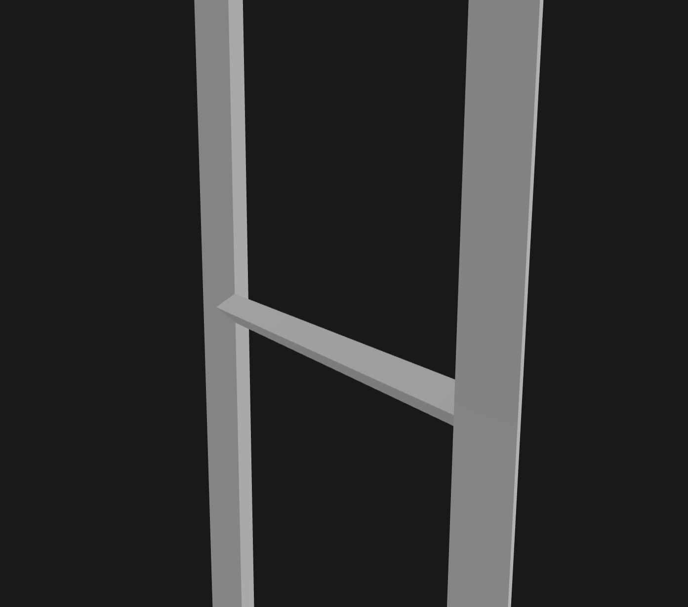

# SolidSKeleton Examples

This directory contains folders with example `.ssk` files that demonstrate valid SolidSKeleton documents.

All files in this example directory have been parsed through the reference scrips in `/reference`, and rendererd in [gltf viewer](https://gltf-viewer.donmccurdy.com/) by Don McCurdy.

## `ladder.ssk` 
An example of a ladder with 14 steps

The ladder describes the use of the `from` class strongly.

*Upright*

*Upclose*

---