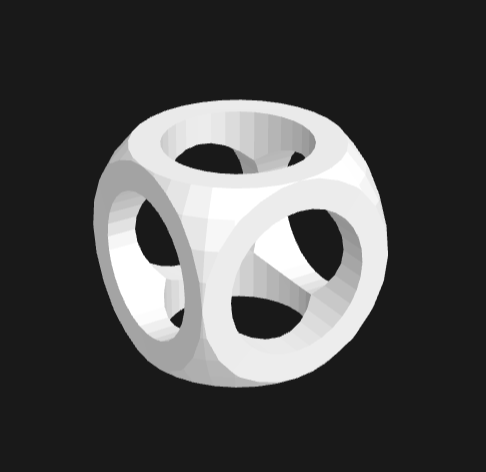

# SolidSKeleton Examples

This directory contains folders with example `.ssk` files that demonstrate valid SolidSKeleton documents.

All files in this example directory have been parsed through the reference scrips in `/reference`, and rendererd in [gltf viewer](https://gltf-viewer.donmccurdy.com/) by Don McCurdy.

---

## `scg_cube.ssk` / `scg_cube.sskb`
An SCG example cube using add, sutract and intersect

ssk file is  *943 Bytes* and the sskb is *314 bytes*

The CSG cube uses many of the core SCG princeples

---

## `ladder.ssk` / `ladder.sskb`
A ladder with 14 steps

ssk file is  *2347 Bytes* and the sskb is *870 bytes*

The ladder describes the use of the `from` class strongly.

---
