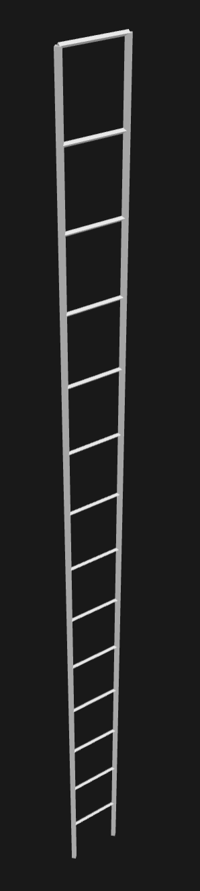
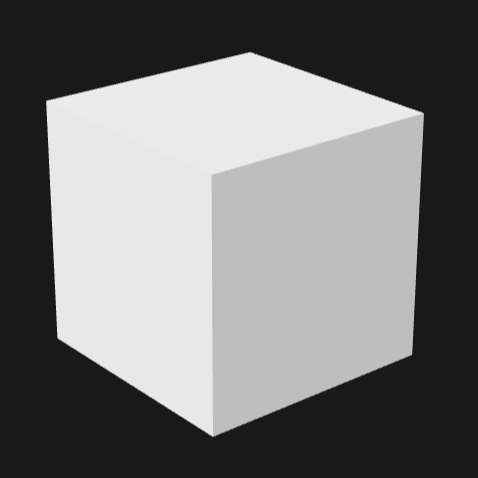
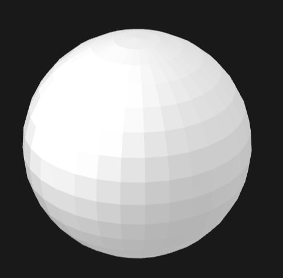
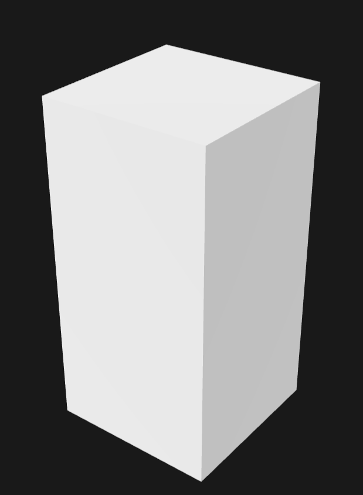
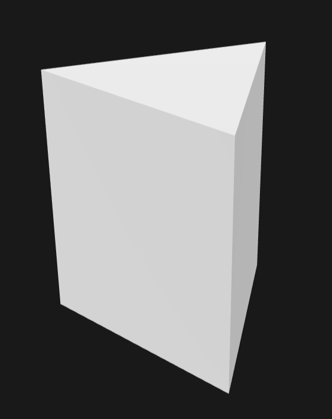
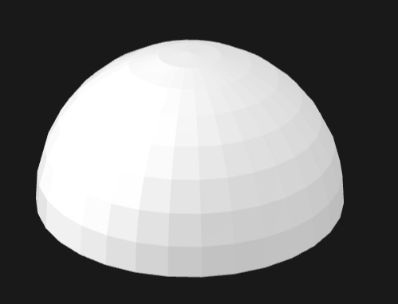
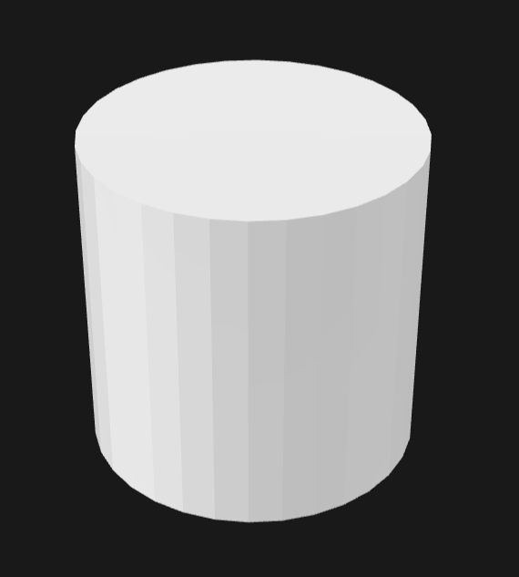
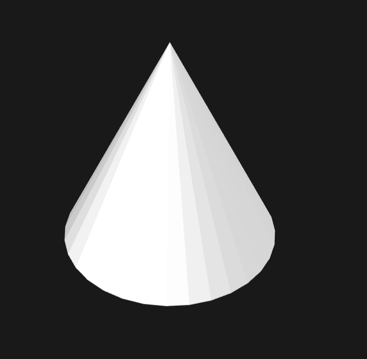

# SolidSKeleton Examples

This directory contains folders with example `.ssk` files that demonstrate valid SolidSKeleton documents.

All files in this example directory have been parsed through the reference scrips in `/reference`, and rendererd in [gltf viewer](https://gltf-viewer.donmccurdy.com/) by Don McCurdy.

---

## `csg_cube.ssk` / `csg_cube.sskb`
An csg example cube using add, sutract and intersect

ssk file is  *943 Bytes* and the sskb is *314 bytes*

The CSG cube uses many of the core csg principles

---

## `ladder.ssk` / `ladder.sskb`
A ladder with 14 steps

ssk file is  *2347 Bytes* and the sskb is *870 bytes*

The ladder describes the use of the `from` class strongly.

---

## Primitives

A collection of the 8 most standard geometric primitives, each demonstrating basic shape construction techniques.

### `cube.ssk` / `cube.sskb`
A regular cube using 4-sided ngon with 45° rotation

ssk file is *283 Bytes* and the sskb is *98 bytes*

### `sphere.ssk` / `sphere.sskb`
An ellipsoid using point-defined circle shape

ssk file is *162 Bytes* and the sskb is *64 bytes*

### `cuboid.ssk` / `cuboid.sskb`
A rectangular box with extended height

ssk file is *283 Bytes* and the sskb is *98 bytes*

### `triangular_prism.ssk` / `triangular_prism.sskb`
A triangle cross-section swept along a path

ssk file is *217 Bytes* and the sskb is *86 bytes*

### `hemisphere.ssk` / `hemisphere.sskb`
A half-sphere with tapered cap

ssk file is *273 Bytes* and the sskb is *94 bytes*

### `cylinder.ssk` / `cylinder.sskb`
A circular cross-section swept along a path

ssk file is *205 Bytes* and the sskb is *82 bytes*

### `cone.ssk` / `cone.sskb`
A tapered circle from base to apex

ssk file is *268 Bytes* and the sskb is *94 bytes*

### `pyramid.ssk` / `pyramid.sskb`
A tapered 4-sided ngon from base to apex

ssk file is *346 Bytes* and the sskb is *110 bytes*

---
